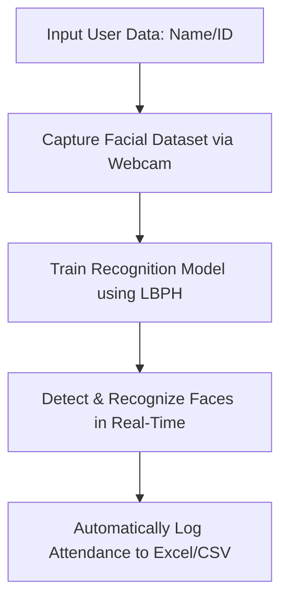

# 🎯 Smart Attendance System with Face Recognition (LBPH)

A real-time face recognition-based attendance system built using Computer Vision to automate and improve the accuracy of attendance tracking.


---

## 📌 Project Overview

This project implements an automated attendance system using **face recognition with the LBPH (Local Binary Patterns Histogram) algorithm**. 

The system captures facial data, trains a recognition model, and records attendance in real-time using a webcam—eliminating the need for manual input and reducing human error.

---

## 🎯 Project Objectives

- **Automate Attendance:** Streamline recording using biometric face recognition.
- **Prevent Fraud:** Reduce proxy attendance ("titip absen") through real-time verification.
- **Enhance Accuracy:** Minimize manual data entry errors for attendance logs.
- **Real-World CV Application:** Implement Computer Vision pipelines in a practical scenario.

---

## ✨ Key Features

- 🎥 **Real-time Detection:** Immediate face detection via live webcam feed.
- 🧠 **LBPH Algorithm:** Robust face recognition utilizing Local Binary Patterns Histogram.
- 📸 **Dataset Collection:** Built-in module to capture and save user facial data.
- ⚙️ **Model Training Pipeline:** One-click model training based on the captured dataset.
- ✅ **Automated Logging:** Instant attendance marking upon successful face matching.
- 💾 **Data Export:** Automated attendance reporting generated directly to CSV and Excel formats.
- 🖥️ **User-Friendly GUI:** Interactive desktop interface built with Tkinter.

---

## 🧠 System Workflow



---

## 📸 Preview & Demo

<div align="center">


| **User Interface** | **Face Recognition** | **Excel Output** |
| :---: | :---: | :---: |
|  |  |  |

<br>

*Face-based attendance system integrated with automated Excel reporting.*

</div>

---

## 🛠️ Tech Stack

- **Language:** Python 3.x
- **Computer Vision:** OpenCV (Open Source Computer Vision Library)
- **Data Manipulation:** NumPy, Pandas
- **GUI Framework:** Tkinter

---

## 📂 Project Structure

```bash
Smart-Absensi/
├── Source/           # Core source code and assets
├── dataset/          # Stored facial image datasets
├── trainer/          # Trained LBPH model files (.yml)
├── Attendance/       # Generated Excel/CSV attendance logs
├── requirements.txt  # Project dependencies
└── README.md         # Project documentation
```

---

## ⚙️ Installation & Setup

### Prerequisite
Ensure you have Python 3.x installed on your system.

### 1. Clone the Repository
```bash
git clone https://github.com/imammularif/SMART-ABSENSI-WITH-FACE-RECOGNITION-LBPH-USING-PYTHON.git
cd SMART-ABSENSI-WITH-FACE-RECOGNITION-LBPH-USING-PYTHON
```

### 2. Install Dependencies
```bash
pip install -r requirements.txt
```

### 3. Run the Application
```bash
python main.py
```

---

## ⚠️ System Requirements & Constraints

- **Hardware:** An active, functioning internal or external webcam.
- **Environment:** Adequate lighting conditions for optimal facial feature extraction.
- **Data Quality:** Clear facial visibility without obstructions during the dataset collection phase.

---

## 🚀 Future Improvements

- Modernize the GUI/UX using advanced libraries like CustomTkinter.
- Integrate relational database systems (MySQL / PostgreSQL) for robust data handling.
- Transition into a web-based platform using Flask or Django.
- Build a centralized dashboard for real-time attendance monitoring and analytics.

---

## 💡 Reflection

This project successfully bridges the gap between Computer Vision theory and practical software engineering. Developing this system provided deep insights into building data pipelines—from raw image collection and feature training to real-time classification and automated business reporting.

---

## 📢 License

This project is open-source and intended strictly for educational and portfolio purposes.

---

## 📩 Connect with Me

- **LinkedIn:** [://linkedin.com](https://www.linkedin.com/in/imammularif/) 
- **GitHub Portfolio:** [github.com/imammularif](https://github.com/imammularif)
